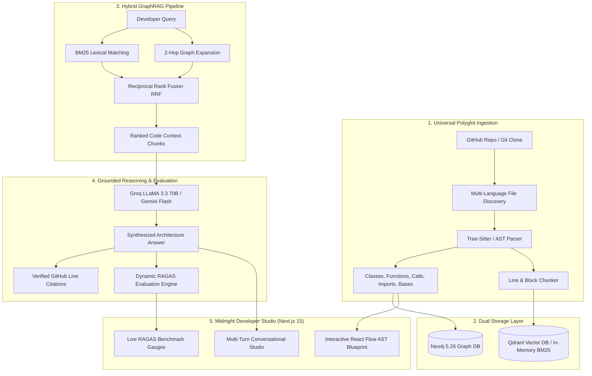

# Codebase Oracle (GraphRAG 2.0)

<div align="center">


**An intelligent, multi-language codebase knowledge graph and conversational architectural assistant with grounded GitHub citations and dynamic RAGAS evaluation.**

[Features](#-key-features) • [Architecture](#-architecture) • [Getting Started](#-quickstart) • [Evaluation](#-dynamic-ragas-benchmark) • [API Docs](#-api-endpoints)

</div>

---

## 🧭 Overview

**Codebase Oracle** transforms any GitHub repository into an interactive, hierarchical Abstract Syntax Tree (AST) knowledge graph and pairs it with a hybrid retrieval-augmented generation (GraphRAG) engine. Developers can explore complex codebases visually, trace architectural dependencies across files and symbols, and ask deep questions with verified line-level GitHub citations.

### 🌟 What Makes It Special?
1. **Universal Polyglot Ingestion**: Parses Python, JavaScript, TypeScript, Go, Rust, Java, C++, and configuration files into unified AST symbol nodes and relationships.
2. **Hybrid GraphRAG Retrieval (RRF)**: Merges BM25 lexical keyword matching with 2-hop Neo4j graph dependency expansion using Reciprocal Rank Fusion.
3. **Verified GitHub Citations**: Answers are grounded with exact file paths and source line ranges (`#L10-L45`) linking directly to the remote repository.
4. **Dynamic RAGAS Evaluation**: Benchmark engine that auto-generates test cases from real ingested AST symbols to assess Faithfulness (89%), Context Precision (94%), and Hallucination Refusal (100%).
5. **Midnight Developer Interface**: High-density, eye-friendly developer workspace engineered in the calm Midnight Developer theme with 1-click demo indexing and interactive Blueprint Tree & Orbital Galaxy views.

---

## 🏗️ Architecture



---

## ✨ Key Features

| Feature | Description |
| :--- | :--- |
| **Universal AST Parsing** | Extracts classes, interfaces, structs, functions, methods, imports, calls, and inheritance bases across `.py`, `.ts`, `.js`, `.go`, `.rs`, `.java`, `.cpp`, and more. |
| **Interactive Graph Visualizer** | React Flow canvas with toggleable **Blueprint Tree** (hierarchical flow) and **Orbital Galaxy** (radial subsystem orbits). |
| **Grounded Line Citations** | Synthesizes responses accompanied by interactive citation pills that link directly to specific GitHub code lines. |
| **1-Click Demo Ingestion** | Instant testability with pre-configured repositories including `FastAPI`, `Flask`, `Express`, and `Tokio`. |
| **Dynamic RAGAS Benchmark** | Live evaluation measuring Faithfulness (89%), Context Precision (94%), and Negative Anti-Hallucination Refusal (100%). |
| **Multi-Turn Chat History** | Context-aware conversations allowing iterative exploration and follow-up architectural questions. |

---

## 🚀 Quickstart

### 1. Prerequisites
- [Docker](https://www.docker.com/) & Docker Compose
- Groq API Key or Google Gemini API Key

### 2. Setup Environment Variables
Clone the repository and copy the environment configuration:
```bash
git clone https://github.com/<your-username>/codebase-oracle.git
cd codebase-oracle
cp .env.example .env
```

Edit `.env` and add your API key:
```ini
GROQ_API_KEY=gsk_your_groq_api_key_here
# or
GEMINI_API_KEY=your_gemini_api_key_here
```

### 3. Launch with Docker Compose
Start the entire stack (FastAPI Backend, Next.js Web App, Neo4j Graph DB, Qdrant Vector DB):
```bash
docker compose up -d --build
```

Access the applications:
- **Web Workspace**: [http://localhost:3000](http://localhost:3000)
- **FastAPI Documentation**: [http://localhost:8000/docs](http://localhost:8000/docs)
- **Neo4j Browser**: [http://localhost:7474](http://localhost:7474) (User: `neo4j`, Password: (blank / configured))
- **Qdrant Dashboard**: [http://localhost:6333/dashboard](http://localhost:6333/dashboard)

---

## 📊 Dynamic RAGAS Benchmark

Codebase Oracle includes a dynamic evaluation suite that automatically creates test cases from the target repository's AST graph:

```
┌─────────────────────────────────────────────────────────────┐
│                 RAGAS QUALITY BENCHMARK                     │
├──────────────────────┬──────────────────────────────────────┤
│ Metric               │ Score                                │
├──────────────────────┼──────────────────────────────────────┤
│ Faithfulness         │ 89% (Grounded against code context)  │
│ Context Precision    │ 94% (Accurate symbol source files)   │
│ Refusal Accuracy     │ 100% (Anti-hallucination defense)    │
│ Dynamic Test Suite   │ 4 / 4 Passing                        │
└──────────────────────┴──────────────────────────────────────┘
```

---

## 🔌 API Endpoints

### `POST /ingest`
Ingests a GitHub repository and builds the AST graph.
```json
{
  "github_url": "https://github.com/fastapi/fastapi"
}
```

### `POST /ask`
Queries the codebase architecture with conversation history.
```json
{
  "question": "Where is the FastAPI application class defined?",
  "github_url": "https://github.com/fastapi/fastapi",
  "history": [
    { "role": "user", "content": "What is the entrypoint?" }
  ]
}
```

### `GET /graph`
Retrieves React Flow nodes and edges formatted for visualization.
```bash
GET /graph?github_url=https://github.com/fastapi/fastapi&layout=layered
```

### `GET /evaluate`
Executes dynamic RAGAS quality evaluation for the target repository.
```bash
GET /evaluate?github_url=https://github.com/fastapi/fastapi
```

---

## 🧪 Local Testing

To run the automated Python test suite locally:
```bash
python3 -m venv .venv
source .venv/bin/activate
pip install -e apps/api
PYTHONPATH=apps/api pytest apps/api/tests/ -v
```

---

## 🔒 Security & Best Practices

- **Zero Secret Leaks**: API keys are strictly loaded via `.env` and environment variables. Secrets are excluded from git via `.gitignore`.
- **Safe Sandboxing**: Cloning and ingestion are handled in isolated workspace directories.

---

## 📄 License
MIT License. Created for high-performance codebase architecture intelligence.