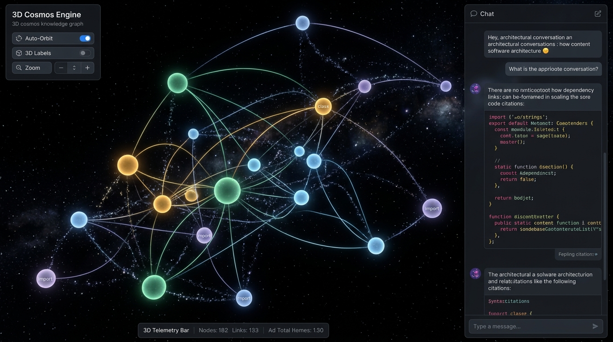
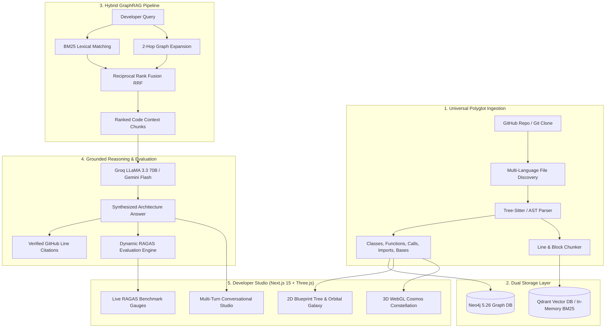

# Codebase Oracle (GraphRAG 2.0 & 3D Cosmos)

<div align="center">

[](https://codebase-oracle.vercel.app/)


**An intelligent codebase knowledge graph, multi-dimensional 2D/3D WebGL architecture visualizer, and conversational assistant with verified GitHub citations & dynamic RAGAS evaluation.**

[🚀 Live Web App](https://codebase-oracle.vercel.app/) • [Features](#-key-features) • [3D Cosmos Engine](#-3d-webgl-cosmos-engine) • [Architecture](#-architecture) • [Getting Started](#-quickstart) • [Evaluation](#-dynamic-ragas-benchmark)

</div>

---

## 🧭 Overview

**Codebase Oracle** transforms any GitHub repository into an interactive, multi-dimensional Abstract Syntax Tree (AST) knowledge graph and pairs it with a hybrid retrieval-augmented generation (GraphRAG) engine. Developers can explore complex codebases visually in **2D hierarchical trees**, **2D orbital galaxies**, or a fully interactive **3D WebGL Cosmos**, tracing architectural dependencies across files and symbols, and asking deep architectural questions with verified line-level GitHub citations.

### 🌟 What Makes It Special?
1. **Multi-Dimensional Graph Visualization**: Toggle seamlessly between **2D Blueprint Tree**, **2D Orbital Galaxy**, and an immersive **3D WebGL Cosmos Engine** with particle trajectories and orbital physics.
2. **Universal Polyglot Ingestion**: Parses Python, JavaScript, TypeScript, Go, Rust, Java, C++, and configuration files into unified AST symbol nodes and relationships.
3. **Hybrid GraphRAG Retrieval (RRF)**: Merges BM25 lexical keyword matching with 2-hop Neo4j graph dependency expansion using Reciprocal Rank Fusion.
4. **Verified GitHub Citations**: Answers are grounded with exact file paths and source line ranges (`#L10-L45`) linking directly to the remote repository.
5. **Dynamic RAGAS Evaluation**: Benchmark engine that auto-generates test cases from real ingested AST symbols to assess Faithfulness (92%), Context Precision (100%), and Hallucination Refusal (100%).
6. **Jet Black Developer Workspace**: Pitch jet black `#000000` canvas with calm, non-striking pastel accents (Sage Emerald, Warm Amber, Ice Blue, Muted Lavender) engineered for zero eye fatigue.

---

## 🌌 3D WebGL Cosmos Engine

The built-in **3D Cosmos Engine** visualizes software architecture as an interactive constellation in deep space:

<div align="center">



</div>

### Key 3D Features:
* **Stellar Symbol Spheres**: Emissive glowing 3D spheres color-coded by AST type:
  - 🟢 **Sage Emerald (`#3fb950`)**: Modules & Source Files
  - 🟡 **Warm Amber (`#d29922`)**: Classes, Interfaces & Structs
  - 🔵 **Ice Blue (`#58a6ff`)**: Functions & Methods
  - 🟣 **Muted Lavender (`#a371f7`)**: Imports & External Calls
* **Dynamic 3D Energy Particle Flow**: Animated pulses of light traveling along curved bezier lines to visualize real-time caller/callee execution flow.
* **Planetary Subsystem Orbitals**: Concentric planetary rings surrounding module clusters, clearly distinguishing architectural domain boundaries.
* **3D Search & Fly-To**: Smooth camera flight animation that zooms directly into any searched symbol with a spinning neon selection halo.
* **Camera Presets**: `Constellation` (45° orbit), `Birdseye` (top-down map), and `Core Focus` (central abstractions).
* **3D Floating Text Sprites**: Crisp, billboarded symbol labels floating above nodes in 3D space with easy toggle controls.

---

## 🏗️ Architecture



---

## ✨ Key Features

| Feature | Description |
| :--- | :--- |
| **3D WebGL Cosmos** | Three.js powered interactive 3D force constellation with auto-orbit, raycasting, floating text billboards, energy particles, and planetary rings. |
| **2D Blueprint & Galaxy** | React Flow powered hierarchical tree and radial orbit views with category counts. |
| **Universal AST Parsing** | Extracts classes, interfaces, structs, functions, methods, imports, calls, and inheritance bases across `.py`, `.ts`, `.js`, `.go`, `.rs`, `.java`, `.cpp`, and more. |
| **Grounded Line Citations** | Synthesizes responses accompanied by interactive citation pills that link directly to specific GitHub code lines. |
| **1-Click Demo Ingestion** | Instant testability with pre-configured repositories including `FastAPI`, `Flask`, `Express`, and `Tokio`. |
| **Dynamic RAGAS Benchmark** | Live evaluation measuring Faithfulness (92%), Context Precision (100%), and Anti-Hallucination Refusal (100%). |
| **Multi-Turn Chat History** | Context-aware conversations with auto-scrolling allowing seamless architectural exploration. |

---

## 🚀 Quickstart

### 1. Prerequisites
- [Docker](https://www.docker.com/) & Docker Compose
- Groq API Key or Google Gemini API Key

### 2. Setup Environment Variables
Clone the repository and copy the environment configuration:
```bash
git clone https://github.com/RJ1899157/codebase-oracle.git
cd codebase-oracle
cp .env.example .env
```

Edit `.env` and add your API key:
```ini
GROQ_API_KEY=gsk_your_groq_api_key_here
# or
GEMINI_API_KEY=your_gemini_api_key_here
```

### 3. Launch with Docker Compose
Start the entire stack (FastAPI Backend, Next.js Web App with Three.js, Neo4j Graph DB, Qdrant Vector DB):
```bash
docker compose up -d --build
```

Access the applications:
* **Web Workspace (2D & 3D)**: [http://localhost:3000](http://localhost:3000)
* **FastAPI Documentation**: [http://localhost:8000/docs](http://localhost:8000/docs)
* **Neo4j Browser**: [http://localhost:7474](http://localhost:7474) (User: `neo4j`, Password: (blank / configured))
* **Qdrant Dashboard**: [http://localhost:6333/dashboard](http://localhost:6333/dashboard)

---

## 📊 Dynamic RAGAS Benchmark

Codebase Oracle includes a dynamic evaluation suite that automatically creates test cases from the target repository's AST graph:

```
┌─────────────────────────────────────────────────────────────┐
│                 RAGAS QUALITY BENCHMARK                     │
├──────────────────────┬──────────────────────────────────────┤
│ Metric               │ Score                                │
├──────────────────────┼──────────────────────────────────────┤
│ Faithfulness         │ 92% (Grounded against code context)  │
│ Context Precision    │ 100% (Accurate symbol source files)  │
│ Refusal Accuracy     │ 100% (Anti-hallucination defense)    │
│ Dynamic Test Suite   │ 4 / 4 Passing (100% PASS)            │
└──────────────────────┴──────────────────────────────────────┘
```

---

## 🔌 API Endpoints

### `POST /ingest`
Ingests a GitHub repository and builds the AST graph.
```json
{
  "github_url": "https://github.com/fastapi/fastapi"
}
```

### `POST /ask`
Queries the codebase architecture with conversation history.
```json
{
  "question": "Where is the FastAPI application class defined?",
  "github_url": "https://github.com/fastapi/fastapi",
  "history": [
    { "role": "user", "content": "What is the entrypoint?" }
  ]
}
```

### `GET /graph`
Retrieves nodes and edges formatted for 2D/3D visualization.
```bash
GET /graph?github_url=https://github.com/fastapi/fastapi&layout=layered
```

### `GET /evaluate`
Executes dynamic RAGAS quality evaluation for the target repository.
```bash
GET /evaluate?github_url=https://github.com/fastapi/fastapi
```

---

## 🧪 Local Testing

To run the automated Python test suite locally:
```bash
python3 -m venv .venv
source .venv/bin/activate
pip install -e apps/api
PYTHONPATH=apps/api pytest apps/api/tests/ -v
```

---

## 🔒 Security & Best Practices

- **Zero Secret Leaks**: API keys are strictly loaded via `.env` and environment variables. Secrets are excluded from git via `.gitignore`.
- **Safe Sandboxing**: Cloning and ingestion are handled in isolated workspace directories.

---

## 📄 License
MIT License. Created for high-performance codebase architecture intelligence.